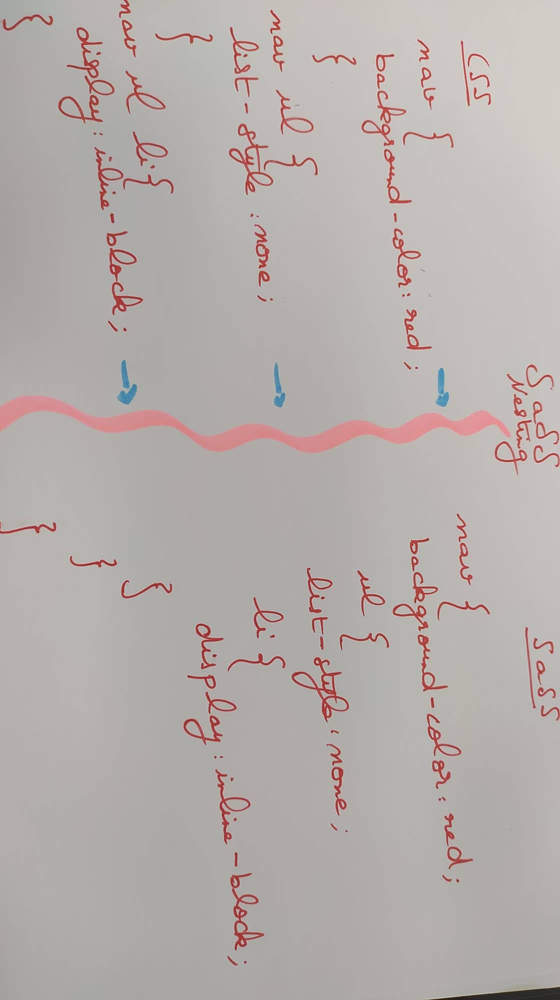
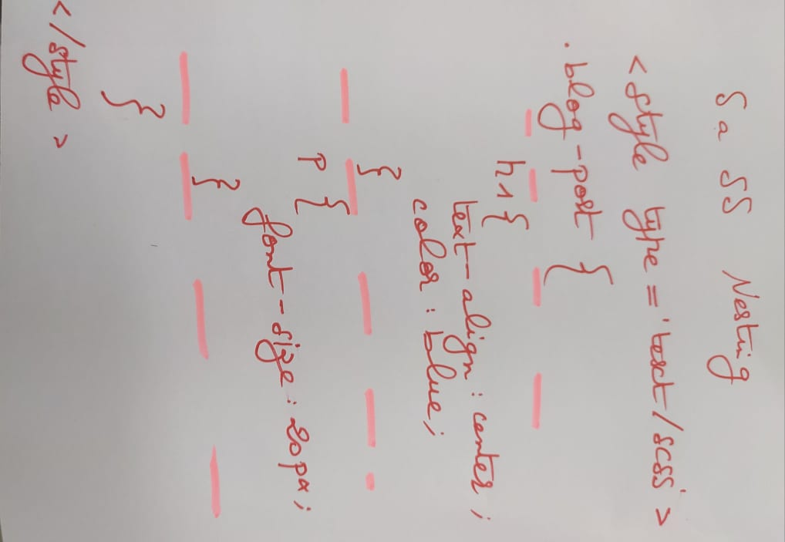
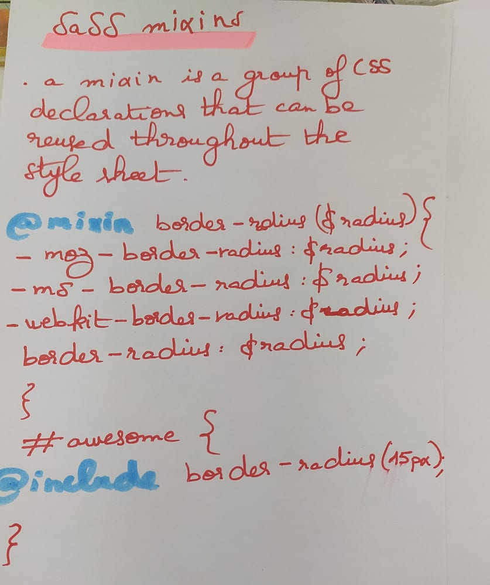

<!-- README.md is generated from README.Rmd. Please edit that file -->

```{r, include = FALSE}
knitr::opts_chunk$set(
  collapse = TRUE,
  comment = "#>"
)
```
# LearningRessources

# SaSS 

##SaSS Nesting





<br>





## SaSS mixins

`@mixin` and `@include`





## @if , @if else and @else


```{css, eval = FALSE}

<style type='text/scss'>

@mixin border-stroke($val){

  @if $val == light {

    border: 1px solid black;

  } 
  
  @else if $val == medium {

    border: 3px solid black;

  } 
  
  @else if $val == heavy {

    border: 6px solid black;

  } 
  
  @else {

    border: none;

  }


}


  #box {
    width: 150px;
    height: 150px;
    background-color: red;
    @include border-stroke(heavy);
  }
</style>

<div id="box"></div>

```

